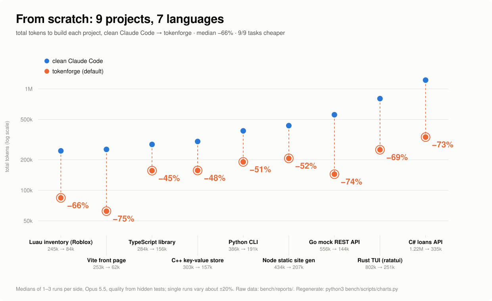
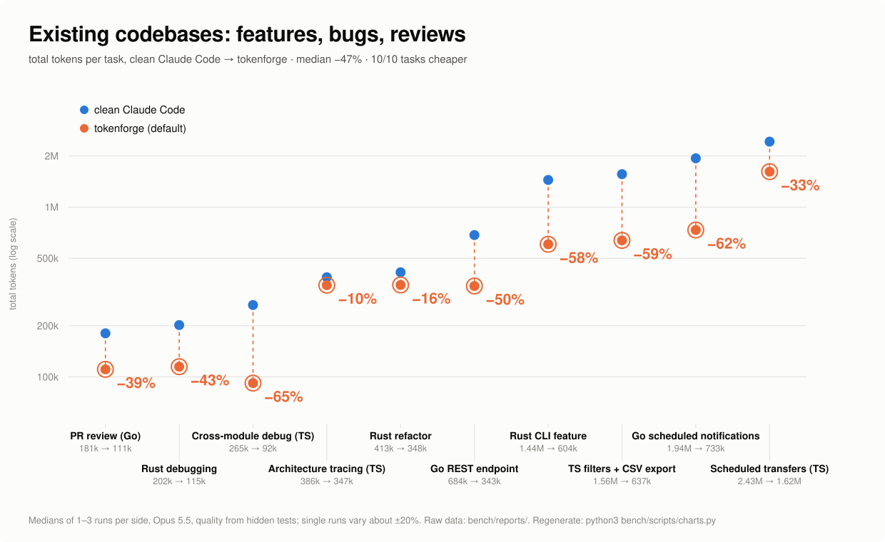
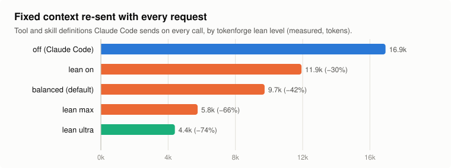
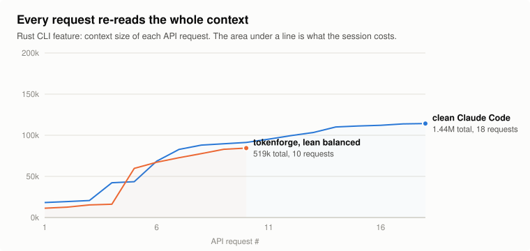

<br/>
<div align="center">
    <h1 align="center">
        TokenForge
    </h1>
    <br>
    <a href="https://github.com/chteau/tokenforge">
        
    </a>
    <br>
    <br>
    <p align="center"><b>TF?!</b> <i>Where the fuck did all my tokens go?</i></p>
    <div align="center">
        
        
        
        
        
        
        
    </div>
    <div align="center">
        <a href="https://github.com/chteau/tokenforge/stargazers"></a>
        <a href="https://github.com/chteau/tokenforge/releases"></a>
        <a href="https://github.com/chteau/tokenforge/releases/latest"></a>
        <a href="https://github.com/chteau/tokenforge/commits/master"></a>
    </div>
    <br/>
</div>

Build big things with Claude Code for a fraction of the tokens.

A long Claude Code session re-sends its whole context on every turn. A build that runs for 150 turns at an average of 80k tokens of context reads about 12M input tokens, even though the code it writes is a tiny part of that. tokenforge changes the shape of the work so that context stays small, without lowering code quality.

- **Plan once.** Your session writes the contracts (shared types and signatures), short library cheat sheets, and a task plan with a check command for every task.
- **Build with disposable workers.** `tforge` runs each task in a fresh, minimal `claude -p` worker. A worker has no hooks, plugins, MCP servers or skills, and only `Read`, `Write` and `Edit`. It sees the contracts, its own files and nothing else, then exits.
- **Tests decide when a task is done.** The driver runs each task's check itself. A failure goes back to the worker condensed: runtime stack frames are dropped. The last retry escalates to a stronger model. A final project-wide check runs integration workers.
- **Measure it.** `tforge meter` shows where the tokens went, per session.

## Where it helps, measured

**Against clean Claude Code.** Every benchmark run uses **Claude Opus 5.5** (`claude-opus-5-5`) on Claude Code 2.1.293, on both sides. This is verified from the model field of every API response in the saved transcripts, not just the `--model` flag. `bench/` runs the same task on the same repo commit in sandboxed sessions, once with clean Claude Code (no plugins, skills, hooks, MCP or CLAUDE.md) and once with tokenforge at its defaults (0.7.0, builds b9471cc0 and 1d360dd5, on the 34 coding tasks; 0.8.0, build 31952bff, on the 2 academic tasks), and scores quality with hidden tests.

**Across all 36 tasks (tokenforge 0.7.0 and 0.8.0 as above, Claude Code 2.1.293), tokenforge used about half the tokens: median −52%, mean −50%, pooled −52%. It used fewer tokens on all 36 tasks, with equal or better quality on all but two.** At list prices, which is roughly what usage limits count (most of the token savings are cache reads, at 0.05× the input price; the 1-hour cache writes Claude Code makes cost 2×), the median is −22%, and it cost less on 34 of 36 tasks: `c-cli` (+9.5%) and `perl-cli` (+5.4%) cost more, both from long up-front plans. The planning line added since cuts those two by about a third (A/B against TokenForge without it, below). Median tool calls: −49%.



| Built from scratch | Clean Claude Code | tokenforge | Saved | Quality |
|---|---:|---:|---:|---|
| Vite front page | 253k | 62k | **−75%** | 100 → 100 |
| Go mock REST API | 556k | 144k | **−74%** | 97.5 → 100 |
| C# loans API (ASP.NET Core) | 1.22M | 335k | **−73%** | 100 → 100 |
| Java URL shortener (JDK HTTP) | 813k | 237k | **−71%** | 100 → 100 |
| Rust TUI (ratatui) | 802k | 251k | **−69%** | 100 → 100 |
| Luau inventory (Roblox-style) | 245k | 84k | **−66%** | 100 → 100 |
| F# expense splitter (.NET) | 847k | 324k | **−62%** | 97.5 → 100 |
| OCaml assembler + VM (dune) | 684k | 270k | **−60%** | 97 → 100 |
| Lua template engine | 781k | 323k | **−59%** | 100 → 100 |
| Zig JSON toolkit | 965k | 412k | **−57%** | 97.07 → 97.07 |
| R survey statistics | 660k | 285k | **−57%** | 97.07 → 97.07 |
| PHP ticketing API (SQLite) | 1.07M | 479k | **−55%** | 100 → 100 |
| Swift cron tool (SwiftPM) | 419k | 192k | **−54%** | 100 → 100 |
| Node static site generator | 434k | 207k | **−52%** | 100 → 100 |
| Elixir job queue (GenServer) | 540k | 267k | **−51%** | 96.94 → 100 |
| Python CLI | 386k | 191k | **−51%** | 100 → 100 |
| C++ key-value store (CMake) | 303k | 157k | **−48%** | 100 → 100 |
| TypeScript library | 284k | 156k | **−45%** | 100 → 100 |
| Dart habit tracker | 443k | 245k | **−45%** | 100 → 100 |
| Bash backup rotation | 623k | 363k | **−42%** | 100 → 100 |
| Perl config linter + merger | 598k | 377k | **−37%** | 100 → 97 |
| Haskell spreadsheet evaluator | 599k | 402k | **−33%** | 100 → 100 |
| C CSV query tool (Make) | 723k | 569k | **−21%** | 100 → 100 |
| Kotlin Markdown converter | 464k | 418k | **−10%** | 100 → 100 |

Median −55% over 24 projects in 23 languages (tokenforge 0.7.0, Claude Code 2.1.293). Perl config merger: every hidden test passes, but tokenforge scores 97 on the structural checks (the entry script is longer than the 30 lines the spec asks for). The agent gets a spec and an empty repo, and hidden black-box tests check the result (CLI, HTTP contract, headless browser, scripted TUI, lune for Luau). A Ruby log analyzer was also run once per side and is left out of these results: tokenforge used 14% more tokens on it (443k vs 390k), quality 96.25 vs 96.83. `bench/benchmark.config.json` lists the exclusion and the runs are kept.



| In an existing codebase | Clean Claude Code | tokenforge | Saved | Quality |
|---|---:|---:|---:|---|
| Cross-module debugging (TS) | 265k | 92k | **−65%** | 100 → 100 |
| Go scheduled notifications | 1.94M | 733k | **−62%** | 100 → 100 |
| TS filters + CSV export | 1.56M | 637k | **−59%** | 100 → 100 |
| Rust CLI feature | 1.44M | 604k | **−58%** | 100 → 100 |
| Go REST endpoint | 684k | 343k | **−50%** | 100 → 100 |
| Rust debugging | 202k | 115k | **−43%** | 88.5 → 100 |
| PR review (Go) | 181k | 111k | **−39%** | 96.67 → 100 |
| Scheduled transfers (TS, multi-layer) | 2.43M | 1.62M | **−33%** | 100 → 94 |
| Rust refactor | 413k | 348k | **−16%** | 100 → 100 |
| Architecture investigation (TS) | 386k | 347k | **−10%** | 100 → 100 |

Median −47% (tokenforge 0.7.0, Claude Code 2.1.293). Scheduled transfers: every hidden test passes, but tokenforge scores 94 on the structural design checks (9/15), as in every tokenforge run of that task.

| Academic work | Clean Claude Code | tokenforge | Saved | Quality |
|---|---:|---:|---:|---|
| Answer questions from a 15-page PDF paper | 274k | 138k | **−50%** | 100 → 100 |
| Proofread a LaTeX manuscript (19 planted errors) | 239k | 157k | **−34%** | 95.3 → 97.8 |

Two runs per side, tokenforge 0.8.0 (build 31952bff), Claude Code 2.1.293. Proofreading: 19 errors planted across a 12-page LaTeX manuscript, scored by how many are found (recall) with a small penalty for false alarms. PDF Q&A: 10 questions answered from a 15-page two-column paper, one of them only from a figure. The PDF task hides `pdftotext`, poppler, Ghostscript and Python PDF libraries on both sides, as on a typical Windows machine; with them installed, both sides simply convert the PDF and the comparison says little.

Each row is the median of 1–3 runs per side, and single runs vary by about ±20%, so read per-task numbers as rough and the overall result as solid. `bench/reports/` has the raw data, and `bench/scripts/charts.py` redraws these charts from it. `bench/` reruns everything.

**Why it works.** Every request re-sends Claude Code's tool and skill definitions, and re-reads everything said so far:





- **Fixed context**: 16.9k tokens per request by default, 9.7k at tokenforge's default lean level (tokenforge 0.7.0, Claude Code 2.1.293). On short tasks this floor is most of the cost.
- **Fewer round trips**: each call re-reads the whole context. Batching (several files per call, one-call code reads with `tread`) built whole projects in 3–9 calls where clean Claude Code took 7–22.
- **Smaller tool results**: they are 80–95% of context growth in existing codebases, and every one is re-read by every later call. Broad dumps fold, long lines are cut, build and test output is compacted.
- **Less code**: "every stated requirement, nothing extra", written concisely but readably.

The older measurements below are about tforge workers, not the hooks.

Numbers come from `tforge meter` (Claude Code 2.1.292, Opus main model). "Input-equivalent" weighs each token type by its relative price: cache writes 1.25×, cache reads 0.1×, output 5×.

**Where the tokens really go.** In one real 11-hour Rust session, the main thread used 1.4M input-equivalent tokens and its 15 subagents used 17.1M (93%):
- 1,253 calls, each re-reading about 80k of context;
- about 570 of their 900 Bash calls were `sed`, `grep` or `cat`, exploring code;
- their total output was only 29k tokens.

Long-lived workers that explore and keep re-reading a growing context are the pattern tokenforge replaces:
- the planner explores once and hands workers exact line ranges;
- every check cycle starts a fresh worker with condensed errors;
- the foreman is a script that costs zero tokens.

**Worker overhead.** A tokenforge worker carries 2.5k tokens of fixed context per call. A default `claude -p` with typical plugins carries 26.2k (10×). Shared context is cached across workers. For haiku tasks, thinking is off by default: on a test-writing task that cut output from 10.6k to 4.3k tokens with the same quality.

**Small greenfield builds: not worth it.** On a browser image editor of about 1–1.6k lines:

| | input-equiv | cost | result |
|---|---|---|---|
| one Opus session | 174k | $0.78 | all checks pass, 35 tests |
| tokenforge 0.1 (before the thinking fix) | 532k | $1.14 | all checks pass, 81 tests |

A strong model writes a fresh small app in a handful of big batches, so the code's own output is most of the cost and there is little context re-reading to remove. The `forge` skill tells Claude to work inline in that case.

## What's new in 0.9.0

- **Planning line**, on by default in main sessions: look at the repo first, plan briefly, never draft code in thinking. In an A/B over 36 paired tasks against the same build without it (a 0.8.0 development build of tokenforge (build c9de32de) on Claude Code 2.1.295): list cost −15% per task (95% CI −21% to −10%), thinking −44%, wall-clock −21%, the same hidden tests passed. `TFORGE_PLAN=0` turns it off.
- **Disk cleanup**: `tforge gc` removes the per-session scratch Claude Code never deletes from `/tmp/claude-<uid>/`, tokenforge's own leftovers, stale snapshots and used-up handoffs, by rules, with no model call. It runs in the background.
- **Instruction files for every agent**: sessions, subagents and workers get the `AGENTS.md`/`CLAUDE.md` text Claude Code leaves out, compacted.
- **Leaner shell output** (tmap 0.5.0): `tkit run`, `tkit batch`, `tkit eval`, `tkit test --failed`, and more commands routed through them.
- **Earlier compaction in 1M-context sessions** (`autoCompactWindow` per lean level): replaying 14 days of sessions, main-session input −40%.
- **Works with [SpecAudit](https://github.com/magicmoux/SpecAudit)** and other skill plugins that bring their own workflow (use `balanced`).
- **Benchmark cost at list prices** (the 0.7.0 and 0.8.0 runs above): TokenForge cost less on 34 of 36 tasks (median −22%). The "36 of 36 cheaper" in 0.8.0 counted tokens.

All releases: [CHANGELOG.md](CHANGELOG.md). What comes next: [ROADMAP.md](ROADMAP.md).

## Install

Inside Claude Code:

```
/plugin marketplace add chteau/tokenforge
/plugin install tokenforge@tokenforge
```

Requirements: Claude Code and Node.js 18 or newer. Subscription (OAuth) logins and API keys both work. `tmap` needs a release binary for your platform, or Rust to build one.

### OpenAI Codex

Codex runs the same hooks. Add the marketplace, install `tokenforge` from it, then open `/hooks` and trust tokenforge's hooks (Codex skips plugin hooks until you do):

```
codex plugin marketplace add chteau/tokenforge
```

What works there: the Bash router (`tkit check`, `tkit test`, `tview`; refusals of interactive ssh and installers), MCP result distillation, the answer cache, prompt routing, the session-start policy, checkpoints and skills. Codex has no Read or Grep tool, so the Read narrowing and code redirect never fire; the 4-minute cap on polling waits is off (Codex takes a rewritten input only with an approval). Context-budget alerts read Claude Code's transcript format and stay silent on Codex. The dashboard and workers are Claude Code only; the proxy also serves Codex with an API key (see API proxy).

### opencode

From a clone of this repository (Node.js on PATH):

```
bin/tforge opencode install            # ~/.config/opencode/plugins/tokenforge.js
bin/tforge opencode install --project  # .opencode/plugins/tokenforge.js, this project only
```

It writes a one-line plugin that loads tokenforge from the clone, so `git pull` updates it; `tforge opencode remove` deletes it. It works with opencode 2 (the `{ id, setup }` plugin, hooks on `ctx.tool` and `ctx.session`) and opencode 1 (the v1 factory), from `.opencode/plugins/`, and runs the same hook scripts: shell commands go through the Bash router (a refusal shows up as the tool's error, a note comes before the output), and the session-start policy and instruction digest are added to the system prompt, the same text on every request so the prompt cache keeps it. Not there yet: MCP distillation, the answer cache, context-budget alerts and checkpoints, which need opencode's message and session events. opencode already reads `CLAUDE.md` and `.claude/skills`.

### Updates

tokenforge is a normal plugin. It never patches Claude Code, wraps the `claude` binary or edits your settings files, so Claude Code's own auto-update keeps working as usual. To update tokenforge itself automatically, open `/plugin`, go to **Marketplaces**, select `tokenforge` and enable auto-update. Otherwise run `/plugin marketplace update tokenforge` whenever you like.

To uninstall, run `/plugin uninstall tokenforge@tokenforge`. Nothing is left behind except `.forge/` folders in the projects where you used it.

## Use

Nothing to learn: once installed it works on its own, in the terminal and in Claude Desktop.

- **Every new session** starts with `TokenForge: active · lean balanced · replies full · dashboard http://127.0.0.1:7878/`, plus a three-line walkthrough for the first three sessions. It is shown to you only, never sent to Claude (`TFORGE_BANNER=0` hides it).
- **After `/clear`** it says what survived: `TokenForge: checkpoint saved (2 min ago, .forge/snapshots/)`. If there is no fresh handoff, a compact version of the last checkpoint (last two requests, files changed, start of the last reply; at most 900 characters, about 250 tokens per call) is reloaded so Claude continues without re-exploring (`TFORGE_CLEAR_RELOAD=0` turns it off).
- **Updates:** once a day, in the background, it checks GitHub for a newer version and shows `TokenForge 0.7.2 is available…` with the command to run (`TFORGE_UPDATE_CHECK=0` turns it off).
- **Papers, notebooks and LaTeX.** `tkit pdf` gives a PDF's text with page markers (opt-in for every Read with `TFORGE_DOCREAD_PDF=1`: Claude Code's own PDF reading, ~1.3k tokens a page, was cheaper on a table-heavy paper and keeps figures, so it stays the default). Notebooks are read as cells, with long outputs trimmed and images left out. LaTeX builds print only errors with file:line, undefined references and citations, and a box summary. `TFORGE_DOCREAD=0` turns the notebook reading off.
- **No permission prompts for its own tools.** TokenForge's read-only tools (`tread`, `tview`, `tkit ctx/diff/debug/deps/check/test`, `tforge recall`) are approved automatically, alone or chained with read-only commands like `grep` and `sed -n`. Network and remote tools (`tkit http/web/ssh`) still ask; the multi-file edit tools (`tkit edit/patch/fmt`) go through only when the session already accepts edits without asking. Without this, every lookup by name asked for permission, so Claude fell back to `cat` and `sed`. `TFORGE_AUTO_ALLOW=0` turns it off.

```
/tokenforge:forge build a browser image editor with layers, three filters, undo/redo and PNG export
```

The skill scaffolds the project with the ecosystem's generator, writes `src/contracts.ts`, the `.forge/cheats/*.md` notes and `.forge/plan.json`, then runs the workers and reports the result. For small jobs (under about 5 files) it tells you to work inline instead, because planning would cost more than it saves.

Other skills:

| Skill | What it does |
|---|---|
| `/tokenforge:handoff` | Writes `.forge/HANDOFF.md` (done, decisions, next steps, file map). Run `/clear` afterwards: the handoff reloads automatically, and the conversation continues at a fraction of the context. |
| `/tokenforge:meter` | Token usage of your recent sessions and worker runs. |
| `/tokenforge:terse` | Reply style: `full` (default), `lite` or `off`. |
| `/tokenforge:dashboard` | Opens the local dashboard and prints its address. |

### Terse replies (built in, replaces caveman-style plugins)

On by default. At session start, and again after compaction, tokenforge adds one reply-style rule of about 60 tokens. Nothing is added per prompt. Answers lead with the result and skip background nobody asked for. Code, paths, commands, numbers and negations stay exact. Security warnings and irreversible steps stay in full sentences. Files Claude writes keep their normal style.

Measured with Sonnet on three everyday questions (output tokens):

| | fixed context per call | EADDRINUSE | rebase vs merge | `rm -rf` lockfile in prod |
|---|---|---|---|---|
| no style plugin | 0 | 937 | 761 | 599 |
| caveman 3.1.0 | +1.2k | 408 | 259 | 389 |
| tokenforge terse | **+0.2k** | **353** | **256** | **182** |

The fixed context is re-read on every API call, tool calls included, so the smaller rule matters most in long, tool-heavy sessions.

Switch with `/tokenforge:terse full|lite|off`. `lite` keeps short full sentences. The choice is saved in `~/.config/tokenforge/config.json`. The env var `TFORGE_TERSE` overrides it. If you also run another reply-style plugin, disable one of them: both rules would load.

### Lean tools

Every request carries the definition of every enabled tool and skill. Lean levels hide the ones a coding session rarely needs. Measured fixed context per request:

| Level | Hides | Per request |
|---|---|---:|
| `off` | nothing | 16.9k |
| `on` | agent-orchestration tools: Workflow, Monitor, Cron*, ScheduleWakeup, RemoteTrigger, PushNotification, SendMessage, ListAgents, TaskStop, DesignSync, ReportFindings, worktrees, NotebookEdit | 11.9k |
| **`balanced`** (default) | also Claude Code's 19 built-in skills, marked `user-invocable-only`: Claude no longer sees them, but you can still type them as slash commands. Your own and plugin skills, subagents and web tools stay. | 9.7k |
| `max` | also the Skill tool, subagents (`Task`), `WebFetch`/`WebSearch` and Claude Code's git instructions | 5.8k |
| `ultra` | also `Read`/`Edit`/`Write`: Claude reads and edits files with Bash (`sed -n`, `cat > file`, scripts). No image or PDF viewing. | 4.4k |

`max` and `ultra` hide the Skill and subagent tools that skill plugins such as [SpecAudit](https://github.com/magicmoux/SpecAudit) run on: use `balanced` with them.

Each level also sets when 1M-context sessions compact (`autoCompactWindow`): at 400k tokens for `on` and `balanced`, 300k for `max`, 200k for `ultra`, instead of near 1M. Every request re-reads the whole context; replaying 14 days of sessions, 400k cut main-session input 40% and subagent input 17%, at one compaction per ~340 calls. Models with a 200k window are unaffected. A value you set yourself, or pick with `/autocompact`, wins, and `off` removes only tokenforge's. Installs from before this get it once, with a notice.

**On first start, tokenforge sets `balanced` once** and tells you so in a message shown to you, not to Claude. It writes only its own entries to `~/.claude/settings.json` (`permissions.deny`, `skillOverrides` and `autoCompactWindow`), because plugins cannot set permissions themselves. It never re-applies after you choose a level. To skip it, set `TFORGE_LEAN_DEFAULT=off` (or `on`, `max`, `ultra`) before the first start. To keep tools a level would deny, list them as `"leanKeep": ["TaskStop"]` in `config.json` (or `TFORGE_LEAN_KEEP`); a rule tokenforge already added for a kept tool is lifted at the next start.

Change the level on the dashboard's **Settings** page, with `/tokenforge:lean <level>`, or with `tforge lean <level>`. The Settings page also picks which built-in skills Claude may still use on its own. `tforge lean off` removes exactly the entries tokenforge added, never your own. Changes apply to sessions started afterwards.

### Dashboard (local web UI)

A local dashboard starts in the background with your first session. Open it with `/tokenforge:dashboard`, or with `tforge ui` in a terminal. The address is `http://127.0.0.1:7878/`, or the next free port.

- **Settings** (sidebar): health first (how many recent sessions actually loaded tokenforge, which run an older build, which still fire hooks of removed plugins; plugins load only when Claude Code starts, and `/clear` does not reload them), then the lean level, which built-in skills Claude may use on its own, and terse replies. The overview shows a one-line banner when something needs attention.
- **Overview:**
  - usage limits, with the time left until each reset;
  - today, 7-day and 30-day totals;
  - a 30-day chart split by token type;
  - the last 48 hours;
  - 5-hour windows over the last week;
  - usage per model.
- **Projects:** every folder Claude Code ran in, with sessions, calls and subagent share. Open a session to see its **context-per-call curve**: every point is re-read by the next call, so the area under the curve is what the session cost. Compactions show up as drops. Below the curve, **Where the tokens went** ranks the session's tool results by estimated cost (size × later calls that re-read it), so you can see which reads were expensive.
- **Memory:** the project's past sessions as a graph of sessions, files they edited and recurring keywords, with the same search Claude gets through `tforge recall`. Click a session for its prompts, commits, files and last reply.
- **Code graph:** folders and files as a force-directed graph, colored by language. Pan, zoom and drag nodes, hover to light up neighbors, switch on call links between files, filter by path or symbol, and click a file for its callers, callees and outline.

**Savings in your status line.** On first start, if you have no status line, TokenForge sets one that shows an estimate of what it saved today, e.g. `TF −45% today (~1.2M saved)`, and says so once in the startup notice. If you already have a status line it is never replaced; `tforge statusline --setup` appends the segment to yours (your command keeps running and printing as before). `tforge statusline --remove` restores exactly what was there; `TFORGE_STATUSLINE=0` turns the automatic setup off. The estimate (lib/estimate.mjs) adds up, for sessions shown in the status line: fixed context the lean level removes from every API call (16.9k tokens at `off` minus your level's measured size, 0 for sessions started before the last lean change), tkit output kept out of context (re-sent on each later call until compaction when it can be tied to the session, otherwise counted once), and prompts the answer cache answered with 0 tokens (one call at the context size before). Percent = saved / (used + saved), in tokens processed (cache reads count fully). Subagents are not counted. The dashboard overview shows the same estimate.

**Limits and resets.** Exact 5-hour and weekly usage and reset times only exist in the status-line data Claude Code passes to a status-line command, so the same status line records them (`tforge statusline --setup` if you kept your own). tokenforge edits your Claude Code settings only for lean tools (once on first start, the default level, see Lean tools, and when you change the level: its own deny and skill entries and `autoCompactWindow`, plus `includeGitInstructions` at `max`/`ultra`) and for the status line above. Without it, the dashboard estimates the 5-hour window from your session timestamps and labels it as an estimate.

**Privacy.** The server listens on 127.0.0.1 only and rejects other Host headers, which blocks DNS rebinding. It answers GET requests, plus one POST for the Settings page (lean level, skills, terse), accepted only from its own page (same-origin `Origin` and a JSON body). It loads nothing from the internet. It reads your transcripts incrementally: only new bytes, with a cache in `~/.cache/tokenforge/`. From transcripts it keeps and serves numbers only, never prompt, reply or file text. Three exceptions: the session page's "Where the tokens went" table, which shows the command or file path behind each costly tool result (read on demand, never cached); the Memory page, which shows prompt and reply snippets and file names from that project's sessions (the index behind it, in `~/.cache/tokenforge/memory/`, holds those snippets); and a project's own `.forge/snapshots/`, shown on its project page so you can see what `/clear` will reload; only files listed in that folder can be requested. `TFORGE_UI=0` disables the auto-start, and `tforge ui --stop` stops it.

### API proxy (optional, off unless you start it)

`tforge claude` runs Claude Code through a local proxy (`ANTHROPIC_BASE_URL=http://127.0.0.1:7879`), started in the background if needed; `tforge proxy` runs it in a terminal, `--detach` in the background, `--stop` stops it. Works with a subscription login or an API key: the proxy forwards every header as sent. It does two things:

- **Logs** every request: sizes of the system prompt, tool definitions and tool results, and the usage the API reports (input, cache reads, cache writes, output). `tforge proxy report [--days N]` sums them, and also shows:
  - **Cache breaks.** A request that reads much less from cache than the previous request of the same conversation had in context. The report gives a probable cause: the system prompt changed, the tool definitions changed, an earlier message changed, or the cache expired (more than 5 minutes, or 1 hour with a 1h TTL). It also says how many tokens were written again.
  - **Folded Reads.** How many Edits hit a file whose Read went out folded, how many of those failed because the text was not found, and how many Reads went back into folded bodies. These say whether folding saves more than it costs.
- **Compresses tool results the first time they are sent.** A whole-file Read above 12k characters (code, not prose or markup) folds long definition bodies, keeping every kept line's number and `Read offset=N limit=M` in place of each fold; partial reads, which Edit works from, stay whole. Bash and other text output loses colors and progress-bar redraws, repeated lines become a count, and output above 16k characters keeps its head and tail with the full text saved to a file the model can grep. When the cut output is a search result (`path:line:` lines or a list of paths), it starts with the match count for every file, or every folder, so the cut part still shows where the matches are. Large JSON loses its indentation, and long arrays keep their first, error-looking and last items.

The prompt cache is why only new results change: if earlier content differs from the last request, the API writes it to the cache again at 1.25× instead of reading it at 0.1×. Each compressed result is remembered by its tool_use_id, so every later request sends the same bytes. A result the proxy first passed unchanged (it was started mid-session) is never touched later, and one that Claude Code itself rewrote passes as sent. If a request cannot be parsed, it goes out unchanged. Once an Edit fails with "not found" on a file whose Read was folded, later Reads of that file are sent whole.

Claude Code keeps `ANTHROPIC_BASE_URL` for the whole session, so `tforge claude` checks every 2 seconds that the proxy is still running and restarts it on the same port if it stopped. An error in one request is logged in `~/.cache/tokenforge/proxy.log` and does not stop the proxy.

To estimate the savings on your own past sessions without calling the API, run `node bench/scripts/proxy-replay.mjs [--days 30]`. It replays the tool results in your transcripts through the same compression and prints only totals.

**Codex (OpenAI Responses API).** The proxy also takes `POST /v1/responses` and compresses large `function_call_output` items the same way (shell outputs like Bash), with the same memo, sent on to `TFORGE_PROXY_OPENAI_UPSTREAM` (default `https://api.openai.com`). Start it with `tforge proxy --detach`, then in `~/.codex/config.toml`:

```toml
model_provider = "tforge"

[model_providers.tforge]
name = "OpenAI via tokenforge"
base_url = "http://127.0.0.1:7879/v1"
env_key = "OPENAI_API_KEY"
wire_api = "responses"
```

Only outputs after the last message (the current turn's tool loop) are compressed, so history already sent stays byte-identical for the prompt cache. Tested with an API key; a ChatGPT-login session goes to a different backend and is untested.

`TFORGE_PROXY_COMPRESS=0` logs only. `TFORGE_PROXY_FOLD=0` turns off Read folding. `TFORGE_PROXY_CAP` sets the Bash output cap in characters (`0`: none). `TFORGE_PROXY_MEMO_MB` caps the memo of compressed results (default 64 MB; the least recently used go first). `TFORGE_PROXY_UPSTREAM` sets where requests go (default: an `ANTHROPIC_BASE_URL` you already had, else `https://api.anthropic.com`).

**Privacy.** The proxy listens on 127.0.0.1 only and rejects other Host headers. Its request log (`~/.cache/tokenforge/proxy/requests-*.jsonl`) holds sizes and token counts only. Two files hold content, both readable by you only and dropped after 14 days: `memo.jsonl` (the compressed results, so later requests can resend them) and `out/` (full outputs that were capped).

### tmap: code map (built in, replaces CodeGraph-style indexers)

`tmap` is a small Rust indexer bundled with the plugin. It parses Rust, TypeScript/TSX, JavaScript, Python and Go with tree-sitter and keeps an index in `~/.cache/tokenforge/tmap`. Every command refreshes the index first, re-parsing only changed files. It respects `.gitignore` and skips dependency and build folders even without one.

```
tmap find <words>        ranked definitions: path:start-end  signature
tmap tree [dir|file]     folders, files and their top-level symbols; a file gives its outline
tmap sym|callers|callees <name>
tmap slice <name>        path:start-end, ready for a forge plan's "reads"
```

Measured on a 1,228-file Rust workspace:
- full index from scratch: 0.9s;
- each later command: about 25 ms;
- one CodeGraph query: 3.4s.

Output for "where is orbit speed handled":

| | output |
|---|---|
| `grep -n orbit` | ~5,100 tokens |
| `codegraph explore` | ~6,200 tokens |
| `codegraph query` | ~220 tokens |
| `tmap find orbit speed` | **~70 tokens**, with the right definition and its line range |

**Where it pays off:** the `forge` skill uses it to hand workers exact line ranges, and `tmap tree` is a fast map for you. In A/B runs of normal Sonnet sessions, a session hint did not get the agent to use `tmap`. Redirecting Grep and Read to it was mixed: two small wins, and one run where the agent worked around it and used more tokens. Both are therefore opt-in:
- `TFORGE_MAP=1` adds a one-line hint at session start;
- `TFORGE_REDIRECT=1` answers identifier-like Grep calls, Bash greps for one code identifier, and whole-file reads of large source files from the index. Repeating the identical call always goes through.

First use: the launcher downloads the prebuilt binary for your platform from this repo's releases and checks it against the published SHA-256. If no release binary fits, it builds once with `cargo` (one to two minutes). `TMAP_BIN` points to your own binary.

### tkit: token-saving tools (built into tmap)

`tkit <tool>` (same as `tmap kit <tool>`) replaces multi-step shell work with one call whose output is short and shaped for the model. The tools are ported from token-surgeon and use the tmap index wherever it needed CodeGraph. Every tool has `--help`.

| Tool | Instead of | Does |
|---|---|---|
| `diff [BASE \| --pr N]` | `git diff` + reading files | stat, touched symbols with callers, affected tests, whole-function diff; degrades to `-U3`, then a hunk index |
| `debug [-- test cmd \| --trace FILE]` | rerun + grep + read frames | failures, top-frame code, code under test, recent diff |
| `analog 'literal'` | grep + opening neighbours | where the literal lives, analog files, one import hop |
| `ctx SYM [--refs \| --outline]` | grep + Read | definition slice, calls, callers |
| `patch` (JSON on stdin) | Edit turn + test turn | atomic find/replace edits, then the narrowest tests |
| `distill -q "question" -- cmd` | reading a huge log | Haiku reads it; only the answer comes back (lossy: never for code you edit) |
| `check [--fast] [--changed] [-e]` | `cargo`/`tsc`/`go vet`/`dotnet build`/... | build + lint, one line per diagnostic |
| `test [FILTER]` | raw test output | summary + failures only |
| `deps ls\|where\|api\|why PKG [SYM]` | browsing `node_modules`, `~/.cargo/registry`, ... | a dependency's API or source location |
| `proj`, `fmt [--check]` | reading manifests, formatting by hand | stack facts; format changed files only |
| `edit [-n] [-d] [-t CMD [--keep]]` | several Edit calls | atomic multi-file `<<< old === new >>>` edits; a failing `-t` test rolls them back |
| `run [--group \| --fuzzy] CMD..` | raw command output | colours and progress stripped, repeats collapsed, capped with the full output saved; `--group`: each grep/rg path once; `--fuzzy`: log lines differing only in numbers merged |
| `batch 'cmd' 'cmd'..` | one Bash call per command | independent commands in one call, each output compacted |
| `eval py\|js\|sh` (code on stdin) | scratch files | throwaway code that leaves no files: in bwrap on Linux (read-only files, private `/tmp`), elsewhere in a temp dir removed after |
| `jx`, `tab`, `tally` | ad-hoc python | JSON/JSONL/TOML queries and edits, SQL over CSV/JSON, counting and stats |
| `img`, `http`, `port`, `ssh`, `web` | screenshots at full size, curl, lsof, interactive ssh, whole web pages | shrink/crop images before reading, compact HTTP, who holds a port, capped non-interactive ssh, page outlines and sections |

`check`, `test`, `deps`, `proj` and `fmt` detect the stack at the nearest manifest: Rust, Go, TS/JS, C#, Luau, Dart, Python, Java/Kotlin, C/C++, PHP, Ruby, Swift, Elixir, Zig, Scala. Linux, macOS and Windows are supported.

Hooks (automatic):

- **Context budget.** Every API call re-reads the whole context from the cache, so cache reads grow with calls × context size. The budget is 50k tokens of context per call, or the session's fixed part (system prompt, tools, skills, hook text, measured on its first call) plus 15k if that is larger.
  - The alert is shown to you; notes reach Claude's context, after tool calls, only with `TFORGE_WATCH_INJECT=1` (an injected "stop and /clear" note ended unattended tasks halfway).
  - Over the budget, your messages are never held. Your next message gets an alert, and again each time the context doubles, and `.forge/HANDOFF.md` is written automatically from this session's snapshots (recent requests, every file changed, the last reply; no model call), so `/clear` at any moment loses nothing: the next session continues from it. A handoff you wrote yourself (`/tokenforge:handoff`) is never overwritten. The automatic one is moved to `.forge/handoffs/` (the newest 10 are kept) once used: when a session that was given it has saved a snapshot of its own work, or after 14 days. `TFORGE_AUTO_HANDOFF=0` turns the automatic one off.
- **Snapshots.** After every reply, the session is saved in chunks to `.forge/snapshots/`: each chunk holds its requests, changed files, last reply and context size, and the subagents it ran: their type and task, the files they changed, the commands they ran and what they reported (read from their own transcripts, where most of a delegating session's tokens go). A chunk closes after 6 requests or at a compaction, and each session starts its own. Hooks write them from the transcript, not Claude, so they cost no tokens and are current even when no handoff was written. Chunks are kept by use, with no model call: a chunk's score adds up its writing and every later read (Claude reading it, the reload after `/clear`, the dashboard), each weighted 1/√(hours since + 1), and is lowered when files it changed are gone or a later chunk changed most of the same files. The newest 6 always stay; the others go once the score falls too low (unread: after about 17 days; 4 once its files are gone, 2 once superseded), and at most 50 are kept per project. The dashboard's project page lists them.
- **Memory.** `tforge recall <words>` searches the project's past sessions, built from your Claude Code transcripts: prompts, commit messages, files edited and read, and how each session ended. It returns the few matching sessions and files (`--session ID` gives one session in full). On startup and `/clear`, Claude gets one line instead of the old snapshot dump: how many earlier sessions exist and the newest one's first prompt, with a pointer to `tforge recall`. Past work then costs tokens only when the task needs it, not ~2k re-read on every call. The index lives in `~/.cache/tokenforge/memory/` and refreshes incrementally. `TFORGE_RECALL=inject` restores the old snapshot loading; `TFORGE_RECALL=0` turns the hint off. In `bench/`'s two-session task (a follow-up on the previous session's feature), recall used a median of 234k tokens against 263k with injected snapshots and 413k for clean Claude Code, at full quality (two runs each; rough).
- **Disk cleanup.** Claude Code keeps each session's scratch (scratchpad, task output, images) in `/tmp/claude-<uid>/` and never deletes it, so a few heavy sessions can fill the disk until transcript writes fail (ENOSPC). `tforge gc` frees, by rules with no model call: the scratch of ended sessions, tokenforge's own leftovers (hook state of ended sessions, old tmap binaries and logs, indexes of deleted projects), snapshot chunks scored out (above), and automatic handoffs once used (moved to `.forge/handoffs/`). A session's scratch is never touched while Claude Code's session registry lists its process as running, while a process has its working directory or an open file inside it, or within 12 hours of its last change or transcript write (1 hour on a nearly full disk); without the registry, none is. Ended sessions' scratch idle for over 7 days goes; the rest stays up to 2 GB, the oldest and largest going first, and on a nearly full disk (under 5% free, within 2-10 GB) it frees until twice that is free. It runs by itself in the background at most every 6 hours (every 10 minutes on a nearly full disk), from session start and Stop, never in unattended sessions. `tforge gc --dry-run` lists what it would free. Off: `TFORGE_GC=0`.
- **Repeated questions.** If you ask an information question you already asked in this project, and that earlier turn changed no files, the prompt is not sent to Claude: you see the earlier answer and its date, at zero tokens. The answer is replayed only when the repository (path and remotes), branch and commit, working tree contents (by content: same-second edits, renames and deletions count), dependency manifests and lockfiles, terse level and, when known, the model are the same as when it was asked. Requests to run, test, build, verify or deploy, security questions and questions about the current state ("is it up", "latest", "now", "en ce moment") always go to Claude, in English and French, as do requests whose point is a fresh look (review, proofread, verify, check, "relis", "vérifie", "sans contexte", "from scratch"…). When unsure, it asks Claude. Start or end a prompt with `!nocache` to skip the lookup, or send the same message again. A closely similar earlier question is not blocked: Claude gets the earlier answer as one short hint. Answers recorded before 0.9.2 are never replayed. Off: `TFORGE_ANSWER_CACHE=0`.
- **Reload.** On startup or `/clear`, `.forge/HANDOFF.md` (if under 14 days old) is loaded into the session, because writing one is a deliberate "continue from here". After `/clear` with no handoff, the compact checkpoint of the latest snapshots is loaded. After a compaction, this session's own checkpoint is loaded, never another session's. On resume, the rules are not sent again (Claude Code keeps them in the transcript); only what changed while the session was away is: a newer handoff, a changed state file, or another session's work here since. `reloadOn` in `config.json` (or `TFORGE_RELOAD_ON`, comma-separated, `0` for none) chooses among `compact` and `resume`.
- **State files.** A skill that keeps its own state (a review register, a plan) can name it in `config.json`: `"stateFiles": [".spec-audit/*/register.md"]` (globs relative to the project, or `TFORGE_STATE_FILES`). Matching files changed in the last 72 hours are loaded at startup, `/clear` and compaction (8000 characters each, 16000 in all), and on resume when changed since; the generic checkpoint is then left out. Never in subagents.
- **Terse rule.** Injected on startup, `/clear` and after compaction (see above), not on resume.
- **Instruction files** (SessionStart, SubagentStart, PostToolUse). Claude Code loads the `CLAUDE.md` chain, but by default skips `AGENTS.md` in a project that has a `CLAUDE.md`, loads nested files only when Read reaches their directory, and gives tforge workers none. tokenforge adds what it left out, following your `instructionFiles` setting (`cc-plugin-agents-md`): the `AGENTS.md` chain with its `@imports`, the file a short pointer `CLAUDE.md` names ("Read AGENTS.md first"), and the nested files of directories a tool call reaches, once per session and agent. Text already loaded is not repeated; HTML comments and badges are dropped, tables compacted, 20k characters at most. Compacted files are cached in `~/.cache/tokenforge/instr/` (keyed by size and modification time), and the injected text stays identical until a file changes, so it stays in the prompt cache. Workers get the whole chain; Explore and Plan get none, as Claude Code gives them no `CLAUDE.md`. Off: `TFORGE_INSTRUCTIONS=0`.
- **Efficiency policy** (SessionStart, SubagentStart). Three lines, about 270 tokens, plus a planning line in main sessions (about 100 more: +106 input tokens per session, median over 36 paired bench tasks): results are re-read on every call, so read code in one call (`tread NAME path:40-80 "path:/regex/"` instead of grep then sed), batch reads and independent commands (`tkit batch`), edit each file in one call, run throwaway code with `tkit eval` instead of scratch files, and run checks once and only after code changes. Scope: every stated requirement and nothing extra (no unasked features, docs, refactors, dependencies or abstractions), reuse existing code, concise but readable code without boilerplate, dead code or comments that restate it, fix shared code once, infer instead of asking, and stop once the checks pass. That is "lazy, not negligent", adapted from ponytail without its challenge-the-requirement mode, which skips requirements. `TFORGE_LAZY=0` drops the scope line. The planning line: thinking is billed as output and re-read on every later call, so look at the repo first, plan briefly, and never draft code in thinking. Over 36 paired bench tasks (a 0.8.0 development build of tokenforge (build c9de32de) on Claude Code 2.1.295) it cut thinking 44% and list cost 15% (95% CI 10–21%), with the same hidden tests passed ([A/B](bench/reports/final-comparison.md)). `TFORGE_PLAN=0` drops it, `TFORGE_PLAN=brief` swaps in a shorter line that only asks for a brief plan. Subagents get the rest of the policy and the instruction files, and a planning line only when `TFORGE_PLAN` names one (the A/B measured main sessions). An agent with its own definition (a plugin's or your own, not Claude Code's built-in ones) gets no scope, ask or planning rules: its definition decides. `subagentSkip` in `config.json` (or `TFORGE_SUBAGENT_SKIP`), a list of agent types with `*` wildcards such as `spec-audit:*`, leaves those agents alone entirely: no policy, instruction files, Bash router or MCP distill. Off: `TFORGE_KIT_POLICY=0`.
- **Bash router** (PreToolUse `Bash|Read`). Raw build and test commands whose flags it fully understands are rewritten to `tkit check` / `tkit test` (cargo, go, tsc, vitest/jest, npm/pnpm/yarn/bun test, dotnet, pytest, dart/flutter, mvn, gradle, mix, zig, swift, ctest, rspec, phpunit/pest, sbt; `.exe`/`.cmd` names included). `ssh HOST CMD` and `scp` become `tkit ssh`. A plain `cat` of project files totalling 12k+ characters goes through `tview`: bodies longer than 8 lines fold to their signature plus the exact `sed -n a,bp` command that prints them, in any language (tmap's parser where it has one, an indentation-based fallback for Luau, Lua, Ruby, Java, C#, Kotlin, C/C++ and the rest), and lines over 400 characters are cut; smaller, focused reads print unchanged. A `grep` or `rg` whose output is not piped goes through `tkit run --group`: each file's path once above its lines, lines over 500 characters cut, at most 200 lines with the full output saved; a recursive `grep` also skips `.git`, `node_modules`, `.venv`, `__pycache__` and a cargo `target` it does not name. File lists, counts and quiet greps run unchanged. `gh run view --log` goes through `tkit run --fuzzy`. A rewrite happens only when every segment becomes a tkit/tview call or is read-only (`grep`, `sed -n`, `ls`, `git status`…), or the session already bypasses permissions; otherwise the line runs unchanged, so a rewrite never adds a prompt. Lines with a heredoc are never touched. Where the prompt cache expires after 5 idle minutes (subagents; a main session only when its transcript shows that cache), a polling loop that asks for more than 4 minutes gets 4 (`until`/`while`/`for` with `sleep` and only reads such as `grep`, `test`, `tail`, `pgrep`), with a one-time note to run it again: a longer wait lets the cache expire, and the next call rewrites the whole context at 12.5× the price of reading it (394 such waits cost 112M input-equivalent tokens in 14 days). Builds, tests, writes and background commands keep their timeout. Refused, with the command to use instead: interactive `ssh HOST`, installers that would stop for an answer, and `less`/`more` or a `cat` in a pipeline inside `node_modules`, `~/.cargo/registry`, Go `pkg/mod`, `~/.m2`, `~/.nuget`, wally and pub caches (`tkit deps api`). Narrowed with a note instead of refused, since Claude Code shows any refusal as "hook error": a lone `cat` of dependency source goes through `tview`; a whole-file Read of dependency source, a lockfile, a minified or generated file reads its first 200 lines (shorter ones are read whole); focused `grep`/`sed -n`/`head` slices go through. A whole Read of a saved tool output of 8k+ characters (`tool-results/*.txt`, whose start Claude Code already previewed) reads its last ~8k characters. Narrowed Reads carry no permission decision, so the usual permission check applies; repeating the same whole Read loads all of it. Anything else runs unchanged. Escape hatches: prefix one command with `TFORGE_RAW=1` (or `TS_RAW=1`; an `export` does not count), or repeat the identical call. With `TFORGE_REDIRECT=1`, a Bash `grep`/`rg`/`git grep` for one code identifier is answered by `tkit ctx` the same way. Off: `TFORGE_KIT_ROUTE=0`.
- **Prompt router** (UserPromptSubmit). Keywords pick review, debug, write or inspect, and that mode's first context is pre-loaded: `tkit diff` for a review (for a PR, Claude is told to run `tkit diff --pr N`: hooks make no network calls), a pasted stack trace resolved by `tkit debug --trace`, `tkit analog` for `backticked` literals when writing, `tkit ctx` for `backticked` symbols when inspecting. Silent for slash commands, short prompts, prompts that match no mode and folders outside git. At most 300 lines (`TFORGE_ROUTE_MAX_LINES`), 8 s per tkit call (`TFORGE_ROUTE_TIMEOUT_MS`). Opt-in since 0.7.0 (`TFORGE_KIT_PROMPT=1`): its mode guess misfired on feature work and its pre-load is re-read on every call.
- **MCP distill** (PostToolUse `mcp__.*`). An MCP result over 6000 bytes is read by Haiku (`tkit distill`) and Claude gets only the facts. Put `#raw` in the tool input for the exact text. Small results, a missing tmap binary, or a failed or timed-out model call leave the result unchanged. Off: `TFORGE_KIT_DISTILL=0`.

`TFORGE_KIT_HOOKS=0` turns off the last four at once.

## The `tforge` command

The plugin puts `tforge` on Claude's PATH. You can also run it yourself with `node <plugin dir>/bin/tforge`.

```
tforge init                 example .forge/plan.json
tforge validate             check the plan, print task order
tforge run [--only a,b] [--force a,b] [-j N] [--dry-run] [--detach] [--proxy]
tforge wait                 wait for a detached run (up to 9 min per call), print its summary
tforge status               task states and spend
tforge prompt <id>          the exact prompt a worker receives
tforge meter [--last N | --all | files...] [--json]
tforge gc [--dry-run] [--json]
```

### Plan format

```json
{
  "version": 1,
  "goal": "Browser image editor",
  "context": ["src/contracts.ts", ".forge/cheats/konva.md"],
  "verify": "npx tsc --noEmit && npx vitest run && npx vite build",
  "defaults": { "model": "sonnet", "retries": 2 },
  "tasks": [
    { "id": "history-test", "spec": "Vitest tests for History in contracts.ts ...", "files": ["src/history.test.ts"], "model": "haiku" },
    { "id": "history", "spec": "Implement History from contracts.ts ...", "files": ["src/history.ts"],
      "reads": ["src/history.test.ts"], "deps": ["history-test"], "verify": "npx vitest run src/history.test.ts" }
  ]
}
```

| Field | Meaning |
|---|---|
| `context` | Files every worker sees. They go into the system prompt, so after the first worker they come from the prompt cache at about a tenth of the price. |
| `verify` | Final project-wide check. If it fails, integration workers fix it, up to `retries` times. |
| `tasks[].files` | Files the task owns. Every file has exactly one owner. Writes outside them are recorded in the ledger. |
| `tasks[].reads` | Extra files inlined for this task only. |
| `tasks[].deps` | Tasks that must pass first. A failed dependency blocks its dependents. |
| `tasks[].verify` | The task's check, one line (join steps with `&&`). Without one, the task passes as soon as its files exist. `tforge validate` warns about destructive commands in it (`rm -rf /`, `git push`, `curl … \| sh`, `sudo`). |
| `tasks[].sensitive` | `true` runs this task's check in a temporary git worktree of HEAD holding the current edits (gitignored files such as `node_modules` are not copied), removed afterwards, even on timeout. Refused outside git. |
| `isolateChecks` | `true` does the same for every task's check and the final `verify`. |
| `tasks[].model` | `haiku`, `sonnet` or `opus`. |
| `defaults` | `model`, `integrateModel`, `tools`, `maxTurns` (12), `retries` (2), `escalate` (true), `budgetUsd` (1.5 per attempt), `timeoutMin` (20), `verifyTimeoutMin` (10), `inlineMaxChars` (60000). |

A task reruns only when its definition (or a dependency's) changes. Use `--force` after changing a contract.

`.forge/state.json`, `.forge/ledger.jsonl` (one line per worker attempt: model, turns, tokens, cost, outcome) and the run files are git-ignored automatically. Commit `plan.json` and the cheat sheets if you like.

## Safety

Workers run with `--permission-mode acceptEdits` and only `Read`, `Write` and `Edit` by default. They cannot run commands. Check commands come from your plan and run on your machine, so read a plan before running it, as you would a Makefile. Run builds on a branch or a git worktree. The workers do not load your settings, hooks, CLAUDE.md or MCP servers. Put project rules that workers must follow into a `context` file.

## Environment

| Variable | Default | |
|---|---|---|
| `TFORGE_CLAUDE` | `claude` | Claude Code binary used for workers |
| `TFORGE_BUDGET` | `50000` | Context budget per call, in tokens |
| `TFORGE_BUDGET_FLOOR` | `15000` | Room always left above the session's fixed context |
| `TFORGE_WATCH` | | `0` disables the context budget |
| `TFORGE_WATCH_INJECT` | | `1` also puts the budget notes into Claude's context |
| `TFORGE_VIEW_CHARS` / `TFORGE_VIEW_FOLD` / `TFORGE_VIEW_LINES` | `12000` / `8` / `40` | `tview`: dump size that folds, body lines that fold, file lines that fold |
| `TFORGE_CHECKPOINT` | | `0` stops writing snapshots |
| `TFORGE_SNAPSHOT_PROMPTS` / `TFORGE_SNAPSHOT_KEEP` | `6` / `50` | Requests per snapshot chunk; most chunks kept per project |
| `TFORGE_HANDOFF_MAX_AGE_H` | `336` | Ignore older handoffs; an older automatic one is moved to `.forge/handoffs/` |
| `TFORGE_RELOAD_ON` | `compact,resume` | When to reload beyond startup and `/clear` (`0`: neither); `reloadOn` in `config.json` |
| `TFORGE_STATE_FILES` | | Comma-separated globs of state files to reload; `stateFiles` in `config.json` |
| `TFORGE_SUBAGENT_SKIP` | | Agent types tokenforge leaves alone (`spec-audit:*`); `subagentSkip` in `config.json` |
| `TFORGE_LEAN_KEEP` | | Tools lean levels never deny; `leanKeep` in `config.json` |
| `TFORGE_TERSE` | | `full`, `lite` or `off`; overrides the saved choice |
| `TFORGE_MAP` | | `1` adds the tmap hint at session start |
| `TFORGE_REDIRECT` | | `1` answers identifier Grep calls, identifier greps in Bash, and big whole-file reads from tmap |
| `TFORGE_KIT_HOOKS` | | `0` disables all tkit hooks (policy, Bash router, prompt router, MCP distill) |
| `TFORGE_KIT_POLICY` / `TFORGE_KIT_ROUTE` / `TFORGE_KIT_DISTILL` | | `0` disables that one hook |
| `TFORGE_PLAN` | | `0` drops the policy's planning line, `brief` uses a shorter one; when set, subagents get it too |
| `TFORGE_KIT_PROMPT` | | `1` enables the prompt router (off by default) |
| `TFORGE_RAW` | | `TFORGE_RAW=1 cmd` runs a Bash command unchanged (`TS_RAW=1` works too) |
| `TFORGE_CAP_ALL` | | `1` caps the output of any other plain Bash command (`tkit run`) |
| `TFORGE_ROUTE_MAX_LINES` / `TFORGE_ROUTE_TIMEOUT_MS` | `300` / `8000` | Prompt router: lines pre-loaded, time per tkit call |
| `TFORGE_DISTILL_MCP_BYTES` | `6000` | MCP results at least this large are distilled |
| `TFORGE_DISTILL_MODEL` / `TFORGE_DISTILL_TIMEOUT` | `haiku` / `120` (`60` in the MCP hook) | Model and seconds for `tkit distill` |
| `TMAP_BIN` | | Use this tmap binary |
| `TFORGE_AUTO_ALLOW` | | `0` makes TokenForge's own read-only tools ask for permission like any other command |
| `TFORGE_CLEAR_RELOAD` | | `0` stops reloading the compact checkpoint after `/clear` |
| `TFORGE_UPDATE_CHECK` | | `0` stops the daily background check for a newer version |
| `TFORGE_AUTO_HANDOFF` | | `0` stops writing `.forge/HANDOFF.md` automatically over the context budget |
| `TFORGE_GC` | | `0` stops the automatic background `tforge gc` |
| `TFORGE_INSTRUCTIONS` | | `0` stops adding the instruction files Claude Code did not load |
| `TFORGE_DOCREAD` | | `0` reads notebooks in their original form (raw outputs and images) |
| `TFORGE_DOCREAD_PDF` | | `1` reads PDFs as extracted text (cheaper on plain prose, dearer on table-heavy papers, no figures) |
| `TFORGE_BANNER` | | `0` hides the "TokenForge: active" line at startup and the checkpoint line after `/clear` |
| `TFORGE_UI` | | `0` stops the dashboard from starting with your first session (it never auto-starts in headless `claude -p`, SDK or CI sessions) |
| `TFORGE_UI_PORT` | `7878` | Dashboard port (the next free one is used if taken) |
| `TFORGE_PROXY_PORT` | `7879` | `tforge proxy` / `tforge claude` port |
| `TFORGE_PROXY_COMPRESS` / `TFORGE_PROXY_FOLD` | | `0`: the proxy only logs / does not fold whole-file Reads |
| `TFORGE_PROXY_CAP` | `16000` | Characters of Bash and other text output the proxy keeps (head and tail); `0`: no cap |
| `TFORGE_RUN_PROXY` | | `1`: `tforge run` workers go through the proxy, the same as `--proxy` or `"proxy": true` in the plan |
| `TFORGE_PROXY_MEMO_MB` | `64` | Size cap of the proxy's memo of compressed results |
| `TFORGE_PROXY_UPSTREAM` | | Where the proxy forwards (default: an existing `ANTHROPIC_BASE_URL`, else the Anthropic API) |
| `TFORGE_PROXY_OPENAI_UPSTREAM` | `https://api.openai.com` | Where the proxy forwards `/v1/responses` (Codex) |
| `TFORGE_NO_DOWNLOAD` | | `1` never downloads tmap; build with cargo instead |
| `TFORGE_DISTILL_MODEL` / `_TIMEOUT` / `_MAX_BYTES` | `haiku` / `120` / `480000` | Model, timeout (s) and input cap for `tkit distill` and `web --ask` |

## Benchmark

`bench/` holds a reproducible A/B benchmark: clean Claude Code against Claude Code with tokenforge only, on the same model, tasks, repo commits and toolchains. It has 10 tasks in existing codebases (Rust, Go, TypeScript; features, debugging, PR review, architecture tracing, refactoring) and 25 from-scratch projects in 24 languages, each with hidden tests or a hidden answer key and a validated reference solution. Every run is sandboxed: an empty `HOME` and config dir, no MCP, and a preflight contamination audit. Token counts come from the API usage in every transcript, tokenforge's own overhead and nested calls included.

```
cd bench
python3 runner/bench.py env build && python3 runner/bench.py doctor
python3 runner/bench.py run --smoke
python3 runner/bench.py run --all
```

Results go to `bench/reports/benchmark-report.md`. See [bench/README.md](bench/README.md) for the method, metrics and scoring.

**Planning line A/B** (shipped as the default; [full report](bench/reports/final-comparison.md)). TokenForge with the planning line against TokenForge without it, plus `brief` as an ablation: 36 tasks, one run per task and arm, the three arms run at the same time, on a 0.8.0 development build of tokenforge (build c9de32de) on Claude Code 2.1.295. List cost −15% per task (geometric mean, 95% CI −21% to −10%; pooled −19%; lower on 27 of 36 tasks), thinking −44%, total tokens −22%, wall-clock −21% (pooled); quality −0.26 points (CI −1.03 to +0.52), hidden tests 1215/1219 in both arms. Nine tasks cost more (up to +26%, `architecture`), mostly existing-codebase and Q&A tasks with little thinking to cut; four scored lower and two higher, each explained in the report. The line's own 106 input tokens per session are included.

**Experiments that did not ship** (TokenForge-only variants, one run per task, kept apart from the main results):

| Variant | Tasks | Total tokens vs default | Quality | Verdict |
|---|---|---|---|---|
| `TFORGE_PLAN=brief` (policy line: plan briefly) | all 36, in the A/B above | +24% vs the `look` default; −2.7% vs no planning line | 4 lower, 2 higher; hidden tests 1214/1219 | list cost +13% vs `look` (pooled); opt-in only |
| PDFs read as extracted text (`TFORGE_DOCREAD_PDF=1`) | PDF Q&A without PDF tools, 2 runs | +37% vs clean Claude Code (376k vs 274k median) | unchanged, but extra calls to recover a figure the text dropped | opt-in only |
| `CLAUDE_CODE_EFFORT_LEVEL=medium` | C, Kotlin, Java, Swift, PHP, Go feature | −5% (−36%, −12%, +5%, +23%, −9%, +17%) | unchanged | within run-to-run noise; not shipped |

Where output tokens go (provider-reported): thinking was 40% of output in the baseline TokenForge runs and 44% in the A/B arm without a planning line; the rest is the code and commands Claude writes and its replies (about 96% and 4% of that, by characters, an estimate). Replies are already short and the code is the work itself, so thinking was the one large lever left: the `look` line brought it down to 32% of output (thinking −44%), `brief` only to 37% (−26%), and `brief` raised first-request thinking.

## Development

```
npm test                        # unit and end-to-end tests with a fake claude binary
cargo test --release --manifest-path native/tmap/Cargo.toml -- --test-threads=1
cargo xwin check --release --tests --target x86_64-pc-windows-msvc --manifest-path native/tmap/Cargo.toml   # Windows build check from Linux
claude --plugin-dir .           # try the plugin locally
claude plugin validate .        # check the manifests
```

MIT licensed.
